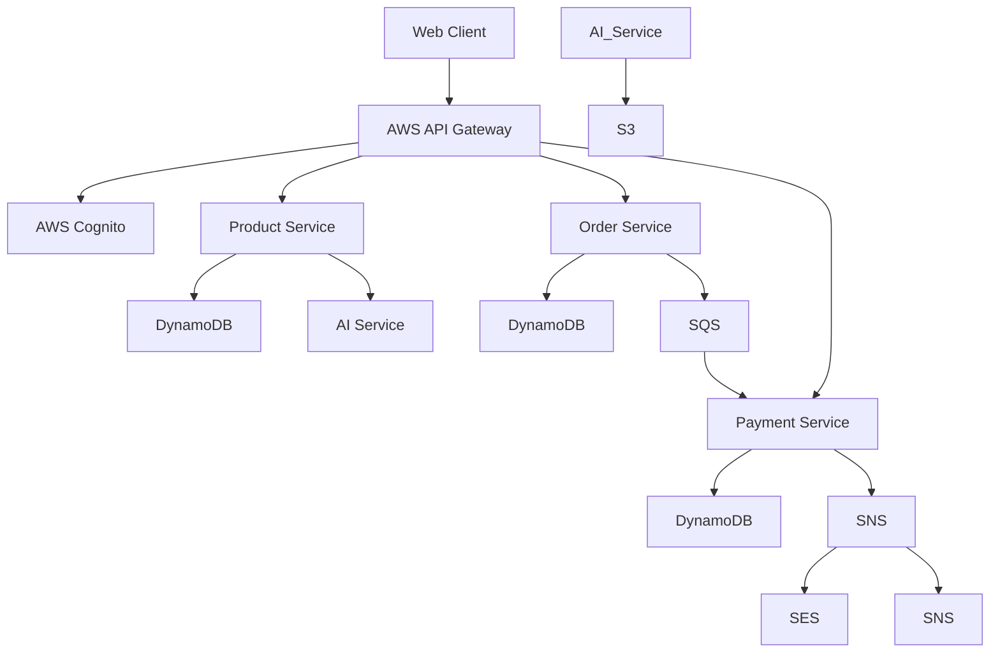

### 1. Tổng quan
- Xây dựng ứng dụng web full-stack
- Sử dụng kiến trúc Microservices và Serverless
- Triển khai trên AWS

### 2. Kiến trúc hệ thống


### 3. Các service chi tiết
#### A. Product Service
- AWS Lambda (Node.js)
- 3 endpoints:
  - `POST /products` - Create product
  - `GET /products` - List products
  - `GET /products/{id}` - Get product by ID
- Database: DynamoDB

#### B. Order Service
- AWS Lambda (Node.js)
- 3 endpoints:
  - `POST /orders` - Create order
  - `GET /orders` - List orders
  - `GET /orders/{id}` - Get order by ID
- Database: DynamoDB
- Queue: SQS

#### C. Payment Service
- AWS Lambda (Node.js)
- 2 endpoints:
  - `POST /payments` - Create payment
  - `GET /payments/{id}` - Get payment by ID
- Database: DynamoDB
- Events: SNS (email, SMS notifications)

#### D. AI Recommendation Service
- AWS Lambda (Python)
- 1 endpoint:
  - `GET /recommendations/{userId}` - Get product recommendations
- AI Model: Amazon SageMaker
- Storage: S3

### 4. Data models
#### Product
```json
{
  "id": "uuid",
  "name": "Product Name",
  "description": "Product Description",
  "price": 100.00,
  "stock": 10,
  "category": "Electronics",
  "image_url": "https://example.com/image.jpg",
  "created_at": "timestamp",
  "updated_at": "timestamp"
}
```

#### Order
```json
{
  "id": "uuid",
  "user_id": "uuid",
  "items": [
    {
      "product_id": "uuid",
      "quantity": 1,
      "price": 100.00
    }
  ],
  "total_amount": 100.00,
  "status": "PENDING",  // PENDING, PROCESSING, SHIPPED, DELIVERED, CANCELLED
  "created_at": "timestamp",
  "updated_at": "timestamp"
}
```

#### Payment
```json
{
  "id": "uuid",
  "order_id": "uuid",
  "amount": 100.00,
  "status": "PENDING",  // PENDING, SUCCESS, FAILED
  "payment_method": "CREDIT_CARD",  // CREDIT_CARD, PAYPAL, STRIPE
  "transaction_id": "tx_123456789",
  "created_at": "timestamp",
  "updated_at": "timestamp"
}
```

### 5. AWS Services Used
1. **Compute**: AWS Lambda (Node.js & Python)
2. **API Gateway**: REST API
3. **Database**: Amazon DynamoDB
4. **Messaging**: Amazon SQS, Amazon SNS
5. **Storage**: Amazon S3
6. **AI/ML**: Amazon SageMaker
7. **Security**: Amazon Cognito, IAM
8. **Email/SMS**: Amazon SES, Amazon SNS

### 6. Setup & Deployment
```bash
# Clone repository
git clone https://github.com/your-username/ws-4week-challenge.git
cd ws-4week-challenge

# Setup environment variables
cp .env.example .env
# Edit .env with your AWS credentials and configuration

# Install dependencies
mkdir -p lambda/product/node_modules
mkdir -p lambda/order/node_modules
mkdir -p lambda/payment/node_modules

cd lambda/product
npm install
cd ../order
npm install
cd ../payment
npm install

# Deploy services
# Use AWS SAM or Terraform to deploy each service
# See deployment guide for detailed instructions
```

### 7. Deployment Guide

Follow the detailed deployment guide in the `docs/deployment.md` file.

### 8. API Documentation

See `docs/api.md` for detailed API documentation.

### 9. Monitoring & Logging
- All Lambda functions have CloudWatch Logs enabled
- Monitor API Gateway metrics in CloudWatch
- Check SQS queue depth
- Monitor DynamoDB read/write capacity

### 10. Testing
- Unit tests for each Lambda function
- Integration tests for API endpoints
- E2E tests for user flows

### 11. Folder Structure
```
ws-4week-challenge/
├── lambda/
│   ├── product/          # Product service
│   │   ├── src/
│   │   ├── node_modules/
│   │   └── package.json
│   ├── order/            # Order service
│   ├── payment/          # Payment service
│   └── ai/               # AI service
├── docs/                 # Documentation
│   ├── deployment.md     # Deployment guide
│   ├── api.md            # API documentation
│   └── architecture.md   # Architecture details
└── .env                  # Environment variables
```
    