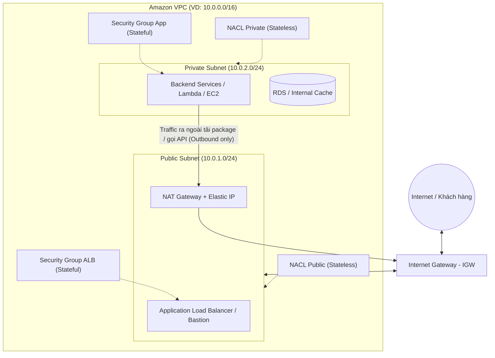
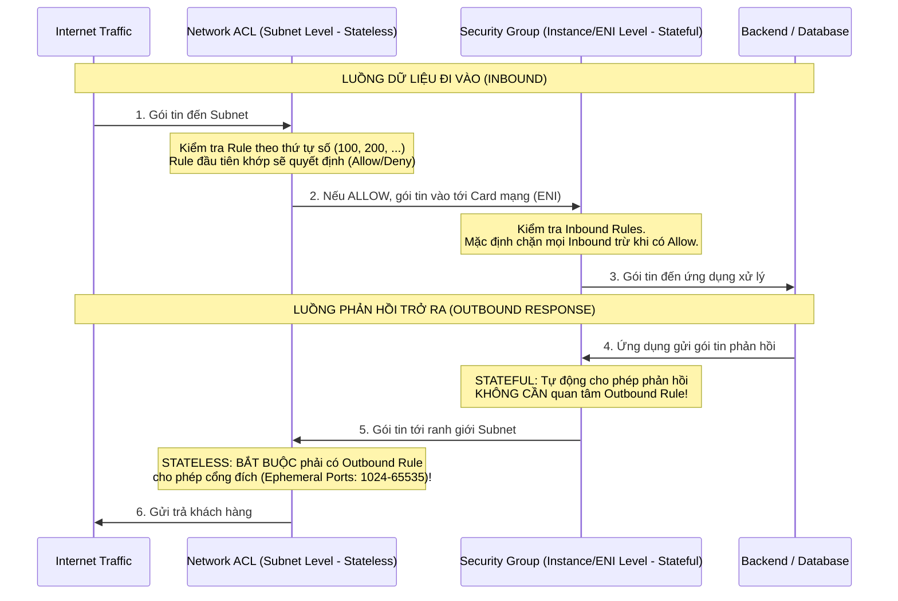

# GIÁO TRÌNH TUẦN 1: TỐI ƯU HẠ TẦNG MẠNG & BẢO MẬT
> **AWS 4-Week Challenge** | Chủ đề: *Network Isolation & Defense-in-Depth*

---

## MỤC LỤC
1. [Bản đồ Kiến trúc Mạng Tuần 1](#1-bản-đồ-kiến-trúc-mạng-tuần-1)
2. [Module 1: Amazon VPC & Phân vùng Subnet](#module-1-amazon-vpc--phân-vùng-subnet)
3. [Module 2: Định tuyến & Luồng dữ liệu (Route Table, IGW, NAT Gateway)](#module-2-định-tuyến--luồng-dữ-liệu-route-table-igw-nat-gateway)
4. [Module 3: Bảo mật đa tầng: Security Group (Stateful) vs NACL (Stateless)](#module-3-bảo-mật-đa-tầng-security-group-stateful-vs-nacl-stateless)
5. [Module 4: Ánh xạ vào Dự án Full-stack Microservices](#module-4-ánh-xạ-vào-dự-án-full-stack-microservices)
6. [Checklist chuẩn bị cho Bài thực hành Thứ 4](#checklist-chuẩn-bị-cho-bài-thực-hành-thứ-4)

---

## 1. Bản đồ Kiến trúc Mạng Tuần 1

---

## Module 1: Amazon VPC & Phân vùng Subnet

### 1. Amazon VPC là gì?
- **Amazon Virtual Private Cloud (VPC)** là một mạng ảo riêng biệt dành riêng cho tài khoản AWS của bạn, tương tự như một Data Center truyền thống nhưng linh hoạt mở rộng theo nhu cầu (Software-Defined Network).
- **Dải địa chỉ CIDR (Classless Inter-Domain Routing):**
  - Thường dùng dải Private IP theo chuẩn RFC 1918 (VD: `10.0.0.0/16` = 65,536 địa chỉ IP).
  - Prefix `/16` đại diện cho Network Bit, phần còn lại dành cho Subnet và Host.

### 2. Public Subnet vs Private Subnet

| Tiêu chí | Public Subnet | Private Subnet |
| :--- | :--- | :--- |
| **Định nghĩa** | Subnet có route trỏ trực tiếp ra **Internet Gateway (IGW)**. | Subnet **không có** route trực tiếp ra Internet Gateway. |
| **Gán Public IP** | Có thể bật *Auto-assign Public IPv4*. | Chỉ có Private IP nội bộ. |
| **Mục đích sử dụng** | Đặt các tài nguyên tiếp nhận lưu lượng từ Internet: Load Balancer (ALB), NAT Gateway, Bastion Host. | Đặt Application Core: Microservices, Database (RDS/Aurora), Business Logic, Cache (Redis). |
| **Khả năng bị tấn công từ Internet** | Có nguy cơ nếu cấu hình sai Port/Firewall. | Cực kỳ an toàn vì hoàn toàn cô lập với Internet bên ngoài. |

> [!NOTE]
> **Quy tắc 5 IP bảo lưu của AWS:**
> Trong mọi Subnet trên AWS, luôn có **5 địa chỉ IP** bị AWS giữ lại cho mục đích hệ thống:
> - `.0`: Network Address.
> - `.1`: VPC Router Address.
> - `.2`: DNS Resolver (Amazon Provided DNS).
> - `.3`: Dành cho tương lai.
> - `.255`: Broadcast Address (AWS không hỗ trợ broadcast nhưng vẫn giữ).
> *Ví dụ:* Subnet `/24` có 256 IP thì chỉ có **251 IP** dùng được cho tài nguyên.

---

## Module 2: Định tuyến & Luồng dữ liệu (Route Table, IGW, NAT Gateway)

### 1. Internet Gateway (IGW)
- Là thành phần VPC có độ sẵn sàng cao, co giãn tự động, không lo tắc nghẽn băng thông.
- **Nhiệm vụ:** Thực hiện chuyển đổi địa chỉ mạng (1-to-1 NAT) giữa Private IP của tài nguyên trong Public Subnet và Public IP của nó trên Internet.
- **Đặc điểm:** Hỗ trợ giao tiếp **hai chiều (Inbound & Outbound)**.

### 2. NAT Gateway (Network Address Translation)
- **Vấn đề đặt ra:** Backend trong Private Subnet cần cập nhật OS (`yum update`), tải thư viện npm/pip, hoặc gọi API thanh toán bên thứ ba (Stripe/PayPal), nhưng KHÔNG ĐƯỢC PHÉP cho Internet kết nối ngược vào.
- **Giải pháp:** Sử dụng **NAT Gateway**.
  - NAT Gateway bắt buộc phải nằm ở **Public Subnet**.
  - NAT Gateway cần được gán một **Elastic IP (Static Public IP)**.
  - Các tài nguyên trong Private Subnet gửi gói tin qua NAT Gateway -> NAT Gateway thay địa chỉ nguồn bằng Elastic IP rồi đẩy ra IGW.
  - Khi phản hồi trả về, NAT Gateway định tuyến lại về tài nguyên Private ban đầu.
  - **Bảo mật:** Chiều từ ngoài Internet vào (Inbound) bị chặn hoàn toàn!

### 3. Bảng định tuyến (Route Table)
- Mỗi Subnet phải liên kết với một Route Table để biết gói tin cần gửi đi đâu.

**Ví dụ Route Table của Public Subnet:**
| Destination | Target | Ý nghĩa |
| :--- | :--- | :--- |
| `10.0.0.0/16` | `local` | Giao tiếp nội bộ bên trong VPC |
| `0.0.0.0/0` | `igw-0123456789abcdef` | Mọi traffic ra ngoài Internet đi qua IGW |

**Ví dụ Route Table của Private Subnet:**
| Destination | Target | Ý nghĩa |
| :--- | :--- | :--- |
| `10.0.0.0/16` | `local` | Giao tiếp nội bộ bên trong VPC |
| `0.0.0.0/0` | `nat-0123456789abcdef` | Traffic ra Internet đi qua NAT Gateway |

---

## Module 3: Bảo mật đa tầng: Security Group (Stateful) vs NACL (Stateless)

Chiến lược bảo mật hàng đầu trên Cloud là **Defense-in-Depth (Bảo vệ theo chiều sâu)**. Ta kết hợp giữa Network ACL (vòng ngoài) và Security Group (vòng trong).

### Bảng so sánh toàn diện: Security Group vs Network ACL

| Tiêu chí | Security Group (SG) | Network ACL (NACL) |
| :--- | :--- | :--- |
| **Phạm vi tác động** | Cấp độ **Giao diện mạng (ENI / Instance / Lambda)** | Cấp độ **Subnet (Biên giới phân vùng mạng)** |
| **Trạng thái lưu trữ** | **Stateful (Có trạng thái)**: Gói tin Inbound được duyệt thì gói Outbound phản hồi tự động được thông qua (và ngược lại). | **Stateless (Không trạng thái)**: Kiểm tra độc lập từng chiều. Chiều Inbound thông qua không có nghĩa là chiều Outbound được phép. |
| **Loại quy tắc** | Chỉ hỗ trợ quy tắc **ALLOW** (Không có Deny tường minh; những gì không cho phép thì mặc định bị DROP). | Hỗ trợ cả **ALLOW** và **DENY** (Rất hữu ích để chặn 1 IP hacker cụ thể). |
| **Thứ tự xử lý** | Đánh giá tất cả các rule trước khi quyết định. | Xử lý theo **Số thứ tự (Rule number)** từ nhỏ đến lớn. Khớp rule nào là dừng ngay (First match wins). |
| **Cổng phản hồi (Ephemeral Ports)** | Tự động xử lý, không cần cấu hình. | **Bắt buộc** phải mở Outbound rule cho dải cổng Ephemeral (`1024 - 65535`) để gói tin phản hồi có thể đi ra ngoài. |

---

## Module 4: Ánh xạ vào Dự án Full-stack Microservices

Theo kiến trúc trong `README.md` của dự án (Product, Order, Payment, AI Service):
1. **API Gateway & Cognito:** Là Managed Serverless Services chạy ở Edge/AWS Network bên ngoài VPC của bạn.
2. **Lambda Microservices:**
   - Mặc định Lambda chạy ngoài VPC.
   - Để Lambda kết nối an toàn với cơ sở dữ liệu hoặc tài nguyên nội bộ, ta cấu hình **VPC-enabled Lambda**:
     - Đặt Lambda vào **Private Subnet**.
     - Lambda được cấp ENI (Elastic Network Interface).
     - Gán Security Group cho Lambda để chỉ cho phép giao tiếp với port DynamoDB / RDS / Cache cần thiết.
   - Khi Lambda trong Private Subnet cần gọi API bên thứ ba (như cổng thanh toán Payment Gateway), traffic sẽ đi qua **NAT Gateway** ở Public Subnet.
3. **VPC Endpoints (Nâng cao):**
   - Thay vì để Lambda đi qua NAT Gateway tốn phí băng thông để gọi DynamoDB / S3, ta dùng **VPC Gateway Endpoint** (hoàn toàn miễn phí và dữ liệu không bao giờ rời khỏi mạng nội bộ AWS).

---

## Checklist chuẩn bị cho Bài thực hành Thứ 4
- [ ] Nắm vững cách tính Subnet & CIDR (ví dụ: `/16`, `/24`).
- [ ] Phân biệt được khi nào dùng IGW, khi nào dùng NAT Gateway.
- [ ] Hiểu rõ vì sao NACL cần mở Ephemeral Ports (`1024 - 65535`) cho chiều Outbound.
- [ ] Biết cách thiết kế Security Group theo nguyên tắc đặc quyền tối thiểu (Least Privilege).
