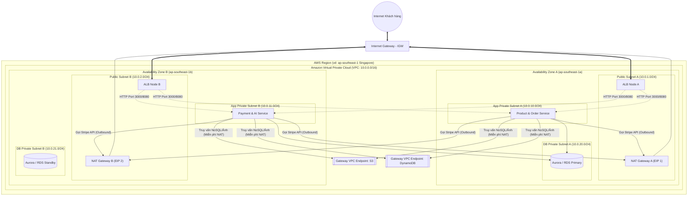

# 📘 BÍ KÍP CHUYÊN SÂU TUẦN 1: TỐI ƯU HẠ TẦNG MẠNG & BẢO MẬT (AWS VPC DEEP DIVE)
> **Dự án:** AWS 4-Week Challenge  
> **Chủ đề tuần 1:** Network Isolation, Traffic Routing & Defense-in-Depth Security  
> **Độ sâu:** Toàn diện từ bản chất vật lý/hypervisor, toán học CIDR, cơ chế gói tin đến kịch bản thực tế.

---

## 📑 MỤC LỤC CHI TIẾT
1. [Bản đồ Kiến trúc Mạng Đa tầng Chuẩn Doanh nghiệp (Enterprise Multi-AZ Architecture)](#1-bản-đồ-kiến-trúc-mạng-đa-tầng-chuẩn-doanh-nghiệp)
2. [Phần 1: Bản chất Amazon VPC & Hạ tầng mạng ảo (Under the Hood)](#phần-1-bản-chất-amazon-vpc--hạ-tầng-mạng-ảo-under-the-hood)
3. [Phần 2: Toán học Mạng & Quy hoạch dải IP (CIDR & Subnetting Deep Dive)](#phần-2-toán-học-mạng--quy-hoạch-dải-ip-cidr--subnetting-deep-dive)
4. [Phần 3: Public Subnet vs Private Subnet & Multi-AZ High Availability](#phần-3-public-subnet-vs-private-subnet--multi-az-high-availability)
5. [Phần 4: Cơ chế Điều hướng (Route Table, Internet Gateway, NAT Gateway)](#phần-4-cơ-chế-điều-hướng-route-table-internet-gateway-nat-gateway)
6. [Phần 5: Mổ xẻ Bảo mật đa tầng: Security Group (Stateful) vs NACL (Stateless)](#phần-5-mổ-xẻ-bảo-mật-đa-tầng-security-group-stateful-vs-nacl-stateless)
7. [Phần 6: VPC Endpoints - Tối ưu Chi phí & Bảo mật cho S3 / DynamoDB](#phần-6-vpc-endpoints---tối-ưu-chi-phí--bảo-mật-cho-s3--dynamodb)
8. [Phần 7: Phân tích Luồng gói tin Từng bước (Packet Flow Step-by-Step)](#phần-7-phân-tích-luồng-gói-tin-từng-bước-packet-flow-step-by-step)
9. [Phần 8: Kịch bản Lỗi kinh điển & Kỹ năng Troubleshooting](#phần-8-kịch-bản-lỗi-kinh-điển--kỹ-năng-troubleshooting)
10. [Phần 9: Thực hành bằng AWS CLI (Hand-on Shell Commands)](#phần-9-thực-hành-bằng-aws-cli-hand-on-shell-commands)

---

## 1. Bản đồ Kiến trúc Mạng Đa tầng Chuẩn Doanh nghiệp

Kiến trúc dưới đây chuẩn bị nền tảng hoàn hảo cho dự án Microservices (Product, Order, Payment, AI Service) chạy an toàn trên 2 Availability Zones (AZ-a & AZ-b):



---

## Phần 1: Bản chất Amazon VPC & Hạ tầng mạng ảo (Under the Hood)

### 1.1. VPC thực chất là gì ở tầng vật lý?
Nhiều người lầm tưởng VPC là một router hoặc switch phần cứng được dành riêng cho bạn trong Data Center của AWS. **Thực tế hoàn toàn không phải vậy:**
- **Software-Defined Networking (SDN):** VPC là một lớp mạng logic trừu tượng hóa được xây dựng trên nền tảng phần mềm điều khiển mạng của AWS (hệ thống **AWS Nitro** và kiến trúc mạng ánh xạ **Hyperplane/Blackfoot**).
- **Encapsulation & Network Isolation:** Mỗi gói tin xuất phát từ một máy ảo EC2 hoặc ENI (Elastic Network Interface) đều được bọc trong một gói tin đóng gói đặc biệt (Encapsulated Packet) ở tầng Hypervisor.
- Gói tin này được gắn kèm một mã định danh mạng ảo (**VNI - Virtual Network Identifier** tương ứng với VPC ID của bạn). Nhờ đó:
  - Dù tài nguyên của bạn và tài nguyên của khách hàng khác cùng chạy trên một máy chủ vật lý, lưu lượng mạng hoàn toàn không thể chạm vào nhau.
  - Bạn có thể chọn dải IP `10.0.0.0/16` trùng khớp hoàn toàn với một tài khoản AWS khác ở cùng Data Center mà không bao giờ bị xung đột IP!

---

## Phần 2: Toán học Mạng & Quy hoạch dải IP (CIDR & Subnetting Deep Dive)

### 2.1. Cấu trúc CIDR (Classless Inter-Domain Routing)
Dải IP có dạng: `IP_Address / Prefix_Length` (Ví dụ: `10.0.0.0/16`).
- Tổng số bit của IPv4 là **32 bit**.
- Con số sau dấu `/` đại diện cho **số bit cố định của phần mạng (Network Prefix)**.
- Số bit còn lại `32 - Prefix_Length` đại diện cho **phần máy (Host Bits)**.
- Công thức tính tổng số IP:
$$\text{Tổng số IP} = 2^{(32 - \text{Prefix})}$$

**Ví dụ:**
- `/16`: Dành cho $32 - 16 = 16$ bit host $\rightarrow 2^{16} = 65,536$ địa chỉ IP.
- `/24`: Dành cho $32 - 24 = 8$ bit host $\rightarrow 2^8 = 256$ địa chỉ IP.
- `/28`: Dành cho $32 - 28 = 4$ bit host $\rightarrow 2^4 = 16$ địa chỉ IP (dải subnet nhỏ nhất AWS cho phép).

### 2.2. Dải IP Private chuẩn (RFC 1918)
Khi thiết kế VPC, **luôn luôn** chọn 1 trong 3 dải IP nội bộ không thể định tuyến trực tiếp trên Internet:
1. `10.0.0.0` đến `10.255.255.255` (`10.0.0.0/8`): Thường được chọn nhất cho doanh nghiệp lớn vì không gian cực kỳ rộng rãi.
2. `172.16.0.0` đến `172.31.255.255` (`172.16.0.0/12`): Mặc định của AWS Default VPC (`172.31.0.0/16`).
3. `192.168.0.0` đến `192.168.255.255` (`192.168.0.0/16`): Phổ biến cho mạng gia đình, văn phòng nhỏ.

> [!CAUTION]
> **Quy tắc vàng khi chọn CIDR cho VPC:**
> Tuyệt đối không chọn dải CIDR của VPC bị trùng lặp với:
> - Mạng Data Center On-Premise của công ty bạn (nếu có kết nối VPN/Direct Connect sau này).
> - Các VPC đối tác khác (nếu cần bắt VPC Peering hoặc Transit Gateway).
> Nếu bị trùng IP, bạn sẽ không thể định tuyến dữ liệu giữa hai bên!

### 2.3. Quy tắc 5 IP bảo lưu của AWS (Rất quan trọng khi thi cử & thiết kế)
Trong mô hình mạng truyền thống, chỉ có 2 IP bị giữ (Network Address và Broadcast Address). Nhưng trong AWS VPC, **AWS luôn giữ 5 IP đầu và cuối trong mỗi Subnet**:

Giả sử Subnet là `10.0.1.0/24` (gồm 256 IP từ `10.0.1.0` đến `10.0.1.255`):
1. `10.0.1.0`: **Network Address** (Địa chỉ mạng - bắt buộc của chuẩn TCP/IP).
2. `10.0.1.1`: **VPC Router Address** (Default Gateway nội bộ do AWS quản lý).
3. `10.0.1.2`: **DNS Server Address** (Amazon Provided DNS / Route 53 Resolver - luôn là địa chỉ cơ sở + 2).
4. `10.0.1.3`: **Reserved by AWS** (Dành cho việc nâng cấp, mở rộng hạ tầng nội bộ trong tương lai).
5. `10.0.1.255`: **Network Broadcast Address** (AWS không hỗ trợ Broadcast, nhưng vẫn giữ để tuân thủ chuẩn TCP/IP).

👉 **Kết luận:** Subnet `/24` có 256 IP thì chỉ có **251 IP khả dụng** cho máy chủ, Lambda ENI, Database!  
Nếu bạn tạo Subnet `/28` (16 IP), bạn chỉ có đúng **11 IP** dùng được.

---

## Phần 3: Public Subnet vs Private Subnet & Multi-AZ High Availability

### 3.1. Phân biệt bản chất kỹ thuật
| Tiêu chí | Public Subnet | Private Subnet | Private Subnet Cô Lập (Isolated) |
| :--- | :--- | :--- | :--- |
| **Đường ra Internet** | Trỏ trực tiếp tới **Internet Gateway (IGW)** (`0.0.0.0/0 -> igw-xxx`) | Trỏ gián tiếp qua **NAT Gateway** (`0.0.0.0/0 -> nat-xxx`) | **Không có route** ra Internet (`0.0.0.0/0` không tồn tại) |
| **Gán Public IP** | Có (Auto-assign Public IPv4 = Enable) | Không (Chỉ có Private IP `10.0.x.x`) | Không |
| **Chiều Inbound (từ ngoài vào)** | Nhận trực tiếp từ Internet nếu SG/NACL mở | Hoàn toàn bị chặn ở tầng định tuyến | Hoàn toàn bị chặn |
| **Chiều Outbound (từ trong ra)** | Đi thẳng ra Internet qua IGW | Đi ra Internet qua NAT Gateway | Không thể ra ngoài Internet |
| **Ứng dụng triển khai** | ALB, NAT Gateway, Bastion Host (Jumpbox) | Backend APIs, Lambda VPC, Microservices, Worker | Database (RDS, Aurora), Cache nhạy cảm |

### 3.2. Thiết kế Multi-AZ (Đa vùng sẵn sàng)
Một AWS Region bao gồm nhiều Availability Zone (AZ) vật lý tách biệt nhau về nguồn điện, hệ thống làm mát và lũ lụt/động đất (cách nhau tối thiểu vài chục km).
- **Public Subnet Multi-AZ:** Đặt ít nhất 2 Public Subnet ở 2 AZ khác nhau để Load Balancer (ALB) có thể dự phòng lỗi.
- **Private Subnet Multi-AZ:** Đặt Backend và RDS Multi-AZ. Nếu cả tòa Data Center ở AZ-a mất điện, hệ thống tự động trỏ traffic sang AZ-b trong vòng 60 giây mà không bị gián đoạn dịch vụ.

---

## Phần 4: Cơ chế Điều hướng (Route Table, Internet Gateway, NAT Gateway)

### 4.1. Internet Gateway (IGW)
- Là một thành phần phần mềm phân tán (Horizontally Scaled, Redundant, Highly Available) của AWS.
- **Không phải là điểm nghẽn (No single point of failure / No bandwidth bottleneck).**
- **Nhiệm vụ:** Thực hiện chuyển đổi địa chỉ mạng 1-1 (1-to-1 NAT):
  - Khi một máy chủ trong Public Subnet có Private IP `10.0.1.50` và Public IP `54.254.x.x`:
  - Bản thân card mạng (ENI) của máy chủ **chỉ biết địa chỉ `10.0.1.50`**. Nó hoàn toàn không nhìn thấy IP `54.254.x.x`.
  - Khi gói tin rời khỏi VPC qua IGW, IGW sẽ thay thế địa chỉ nguồn `10.0.1.50` thành `54.254.x.x`. Khi phản hồi từ Internet về tới `54.254.x.x`, IGW chuyển đổi ngược lại thành `10.0.1.50` để đưa vào máy chủ.

### 4.2. NAT Gateway vs NAT Instance (Kiến thức phỏng vấn AWS)
Trước năm 2015, kỹ sư phải tự dựng một máy ảo EC2 cài Linux iptables để làm NAT (gọi là NAT Instance). Nay AWS đã cung cấp **NAT Gateway**:

| Tiêu chí | NAT Gateway (Khuyên dùng) | NAT Instance (Cũ / Tự build) |
| :--- | :--- | :--- |
| **Vận hành (Maintenance)** | AWS tự quản lý hoàn toàn (Managed Service), tự vá lỗi, tự cập nhật OS. | Bạn phải tự quản lý OS, bảo mật, vá lỗi bảo mật (Security Patches). |
| **Độ sẵn sàng (High Availability)** | Tự động dự phòng lỗi bên trong 1 AZ. Băng thông co giãn từ 5 Gbps lên tới 100 Gbps. | Không tự co giãn. Nếu EC2 chết, toàn bộ Private Subnet mất mạng trừ khi tự viết script tự phục hồi. |
| **Vị trí đặt** | Bắt buộc phải đặt ở **Public Subnet** và gắn 1 **Elastic IP**. | Đặt ở Public Subnet, phải tắt cơ chế kiểm tra gói tin: `Source/Destination Check = Disable`. |
| **Chi phí** | Đắt hơn: Tính tiền theo giờ (~$0.045/giờ/AZ) + phí băng thông xử lý data (~$0.045/GB). | Rẻ hơn: Chỉ tốn tiền thuê máy chủ EC2 (ví dụ `t4g.nano`). |

> [!WARNING]
> **Vấn đề chi phí của NAT Gateway trong bài toán lớn:**
> Nếu Microservices trong Private Subnet tải hàng chục Terabyte dữ liệu mỗi tháng từ AWS S3 hoặc DynamoDB thông qua NAT Gateway, hóa đơn AWS của bạn có thể tăng thêm hàng trăm đến hàng nghìn USD chỉ riêng tiền phí băng thông NAT Gateway (`Data Processing Fee`)!  
> ➔ Giải pháp bắt buộc: Dùng **VPC Endpoints** (xem Phần 6).

---

## Phần 5: Mổ xẻ Bảo mật đa tầng: Security Group (Stateful) vs NACL (Stateless)

Đây là chủ đề cốt lõi của Tuần 1. Sự kết hợp giữa Security Group và NACL tạo ra mô hình bảo vệ "Cổng làng & Cửa nhà":

```
[Internet] 
    │
    ▼ (Cổng làng: Kiểm soát toàn bộ xe cộ vào Subnet)
┌─────────────────────────────────────────────────────────┐
│               Network ACL (NACL - Stateless)            │
│  - Hoạt động ở mức ranh giới Subnet                     │
│  - Kiểm tra số thứ tự Rule (100, 200, *)                │
│  - Hỗ trợ ALLOW và DENY                                  │
│  - Chiều về KHÔNG TỰ NHỚ -> Phải mở Ephemeral Ports    │
└───────────────────────────┬─────────────────────────────┘
                            │ (Cho phép qua)
                            ▼ (Cửa nhà: Kiểm soát người bước vào phòng)
┌─────────────────────────────────────────────────────────┐
│               Security Group (SG - Stateful)            │
│  - Hoạt động ở mức Card mạng ảo (ENI / Instance)        │
│  - Chỉ có ALLOW (Mặc định chặn hết Inbound)             │
│  - TỰ ĐỘNG NHỚ TRẠNG THÁI (Stateful)                    │
│  - Chiều về tự động thông suốt không cần mở port        │
└───────────────────────────┬─────────────────────────────┘
                            │
                            ▼
               [Ứng dụng / Database]
```

### 5.1. Cơ chế Stateful của Security Group (Hoạt động thế nào ở tầng nhân?)
- Khi một gói tin đi qua Security Group (ví dụ: Inbound HTTP Port 80 được phép), Hypervisor sẽ ghi nhận một phiên kết nối vào **Bảng theo dõi trạng thái kết nối (Connection Tracking Table)**.
- Khi server tạo gói tin phản hồi trả về cho khách hàng, Hypervisor kiểm tra bảng Connection Tracking:
  - *"À, gói tin này thuộc về kết nối HTTP Port 80 vừa được duyệt vào ban nãy!"*
  - Hypervisor cho phép gói tin đi ra ngay lập tức, **bất kể Security Group Outbound Rules có chặn hay không!**

### 5.2. Cơ chế Stateless của NACL & Bí ẩn "Ephemeral Ports"
- NACL **hoàn toàn không có bộ nhớ** (Stateless). Nó coi mỗi gói tin đến là một thực thể độc lập, không liên quan gì đến gói tin trước đó.
- **Hiện tượng Ephemeral Ports (Cổng tạm thời):**
  - Khi một client (trình duyệt của bạn) kết nối tới Web Server qua cổng 80 hoặc 443, hệ điều hành của client sẽ mở một **cổng ngẫu nhiên có số hiệu cao** (gọi là Ephemeral Port) để nhận dữ liệu phản hồi:
    - Linux kernel: Cổng từ `32768` đến `60999`.
    - Windows: Cổng từ `49152` đến `65535`.
    - AWS quy định chung dải cổng: **`1024 - 65535`**.
  - **Hậu quả nếu không hiểu bản chất:**
    - Bạn tạo Inbound Rule trên NACL: Allow Port 80.
    - Gói tin khách hàng đi vào server thành công.
    - Server xử lý xong và gửi gói phản hồi từ Port 80 đến Client Port (ví dụ `52411`).
    - Khi gói phản hồi chạm tới ranh giới Subnet, NACL kiểm tra Outbound Rules.
    - Nếu Outbound Rules của NACL **chưa mở dải cổng `1024 - 65535`**, NACL sẽ **DROP (vứt bỏ)** gói tin phản hồi ngay lập tức!
    - Kết quả: Khách hàng bị quay tròn vô tận và nhận lỗi **Request Timeout**.

### 5.3. Bảng so sánh "Kê đơn bốc thuốc" khi nào dùng SG, khi nào dùng NACL

| Tình huống thực tế | Dùng Security Group | Dùng Network ACL | Giải thích chuyên sâu |
| :--- | :---: | :---: | :--- |
| Cho phép Web Client truy cập cổng 443 | ✅ **Chính** | ✅ (Default allow) | SG dễ quản lý, tự nhớ trạng thái phản hồi. |
| Phát hiện IP `118.69.12.3` đang brute-force SSH, cần chặn ngay | ❌ | ✅ **Bắt buộc** | Security Group **không có quy tắc DENY**. Chỉ có NACL mới có thể tạo rule `DENY 118.69.12.3/32`. |
| Chỉ cho phép Backend kết nối tới Database | ✅ **Chính** | ⚠️ | Dùng **Security Group Referencing**: Trong SG của Database, chỉ cho phép Inbound từ `sg-backend-id`. Đây là Best Practice tối thượng! |
| Kiểm soát an ninh mức phân vùng (Subnet Isolation) | ⚠️ | ✅ **Chính** | Đảm bảo ngay từ ranh giới Subnet, traffic trái phép không thể lọt vào bên trong. |

---

## Phần 6: VPC Endpoints - Tối ưu Chi phí & Bảo mật cho S3 / DynamoDB

Trong kiến trúc của dự án của bạn (`README.md`), dịch vụ Product & AI Service cần đọc ghi vào **Amazon DynamoDB** và lưu trữ file ảnh vào **Amazon S3**.
- Cả DynamoDB và S3 đều là **Public AWS Services** (có IP Public của AWS, nằm ngoài VPC của bạn).
- Nếu không có cấu hình đặc biệt, Lambda/EC2 từ Private Subnet muốn gọi DynamoDB sẽ phải đi qua:
  $$\text{Private Subnet} \longrightarrow \text{NAT Gateway} \longrightarrow \text{Internet Gateway} \longrightarrow \text{DynamoDB}$$
  - Nhược điểm: **Chậm (High Latency)** + **Tốn tiền băng thông NAT Gateway**!

### Giải pháp: VPC Gateway Endpoint (Miễn phí 100%)
- AWS cung cấp **Gateway Endpoint** dành riêng cho 2 dịch vụ: **Amazon S3** và **Amazon DynamoDB**.
- Khi bật Gateway Endpoint:
  - AWS tự động thêm một Route đặc biệt vào Route Table của Private Subnet:
    `pl-xxxx (Prefix List DynamoDB) -> vpce-xxxx`
  - Gói tin từ Private Subnet đi thẳng qua mạng cáp quang nội bộ của AWS đến DynamoDB mà **không cần qua NAT Gateway**, không ra Internet, bảo mật tuyệt đối và tốc độ cực nhanh!

---

## Phần 7: Phân tích Luồng gói tin Từng bước (Packet Flow Step-by-Step)

### Luồng 1: Khách hàng ngoài Internet mua hàng (Inbound Traffic)
1. **Khách hàng** bấm "Thanh toán" trên Web ➔ Gửi gói tin HTTP SYN tới DNS của Application Load Balancer (ALB).
2. Gói tin đến **Internet Gateway (IGW)** ➔ IGW chuyển tiếp vào **Public Subnet**.
3. Chạm **NACL của Public Subnet** ➔ Kiểm tra Inbound Rule: Có cho phép Port 443/80 không? ➔ **ALLOW**.
4. Chạm **Security Group của ALB** ➔ Kiểm tra Inbound Rule: Port 443 từ `0.0.0.0/0` ➔ **ALLOW**.
5. ALB nhận gói tin, phân tích URL `/orders` ➔ Quyết định chuyển tiếp cho Lambda/EC2 trong **App Private Subnet**.
6. Chạm **NACL của App Private Subnet** ➔ Kiểm tra Inbound Rule từ dải IP VPC ➔ **ALLOW**.
7. Chạm **Security Group của App** ➔ Kiểm tra rule: Chỉ nhận traffic từ `sg-alb` ➔ **ALLOW**.
8. Ứng dụng xử lý tạo đơn hàng thành công!

### Luồng 2: Order Service gọi cổng Stripe thanh toán (Outbound Traffic)
1. Code Node.js trong **App Private Subnet** tạo HTTP POST tới `api.stripe.com`.
2. Kiểm tra **Security Group của App** ➔ Outbound Rule mặc định: Cho phép mọi traffic ra ngoài (`0.0.0.0/0`) ➔ **ALLOW**.
3. Chạm **NACL của App Private Subnet** ➔ Outbound Rule: Cho phép Port 443 ra ngoài ➔ **ALLOW**.
4. Tra cứu **Route Table của App Subnet**:
   - `10.0.0.0/16` ➔ Nội bộ.
   - `0.0.0.0/0` (IP Stripe) ➔ Đẩy gói tin sang **NAT Gateway** ở Public Subnet.
5. **NAT Gateway** nhận gói tin:
   - Ghi nhớ địa chỉ nguồn ban đầu `10.0.10.45:51234`.
   - Đổi địa chỉ nguồn thành **Elastic IP công khai** của NAT Gateway: `13.228.x.x:62001`.
   - Gửi gói tin sang Route Table của Public Subnet ➔ Đi ra **Internet Gateway** tới Stripe Server.
6. Stripe xử lý xong và phản hồi về `13.228.x.x:62001`.
7. **NAT Gateway** tra bảng NAT, đổi địa chỉ đích lại thành `10.0.10.45:51234` và chuyển về cho Order Service.

---

## Phần 8: Kịch bản Lỗi kinh điển & Kỹ năng Troubleshooting

### ❌ Lỗi 1: Máy chủ trong Public Subnet nhưng ping không ra mạng ngoài
- **Triệu chứng:** Khởi tạo EC2 trong Public Subnet, nhưng lệnh `ping 8.8.8.8` hoặc `curl google.com` bị timeout.
- **Nguyên nhân phổ biến:**
  1. EC2 chưa được gán **Public IPv4 Address** (chỉ có Private IP thì dù Route Table có trỏ ra IGW cũng vô nghĩa vì Internet không biết gửi phản hồi về đâu).
  2. Quên gắn Internet Gateway vào VPC (`Attach to VPC`).
  3. Route Table của Subnet thiếu dòng: `0.0.0.0/0 -> igw-xxxx`.

### ❌ Lỗi 2: Backend trong Private Subnet không kết nối được Database
- **Triệu chứng:** Backend ghi log `Connection Refused` hoặc `ETIMEDOUT` tới RDS PostgreSQL/MySQL.
- **Nguyên nhân & Khắc phục:**
  1. Kiểm tra **Security Group của Database**: Đã mở Inbound Port `5432` (Postgres) hoặc `3306` (MySQL) với Source là Security Group của Backend (`sg-backend`) chưa?
  2. Kiểm tra Route Table: Cả hai Subnet có cùng nằm trong một VPC không? (Nếu cùng VPC, route `10.0.0.0/16 -> local` tự động đảm bảo thông mạng).

---

## Phần 9: Thực hành bằng AWS CLI (Hand-on Shell Commands)

Dưới đây là các lệnh AWS CLI chuẩn để bạn có thể tự tay tạo toàn bộ hạ tầng mạng này từ dòng lệnh:

```bash
# 1. Tạo VPC với dải IP 10.0.0.0/16
VPC_ID=$(aws ec2 create-vpc --cidr-block 10.0.0.0/16 \
  --tag-specifications 'ResourceType=vpc,Tags=[{Key=Name,Value=ws-challenge-vpc}]' \
  --query 'Vpc.VpcId' --output text)
echo "Đã tạo VPC: $VPC_ID"

# 2. Bật DNS Hostnames cho VPC
aws ec2 modify-vpc-attribute --vpc-id $VPC_ID --enable-dns-hostnames "{\"Value\":true}"

# 3. Tạo Internet Gateway và gắn (Attach) vào VPC
IGW_ID=$(aws ec2 create-internet-gateway \
  --tag-specifications 'ResourceType=internet-gateway,Tags=[{Key=Name,Value=ws-challenge-igw}]' \
  --query 'InternetGateway.InternetGatewayId' --output text)
aws ec2 attach-internet-gateway --vpc-id $VPC_ID --internet-gateway-id $IGW_ID

# 4. Tạo Public Subnet (10.0.1.0/24)
PUB_SUBNET_ID=$(aws ec2 create-subnet --vpc-id $VPC_ID --cidr-block 10.0.1.0/24 \
  --availability-zone ap-southeast-1a \
  --tag-specifications 'ResourceType=subnet,Tags=[{Key=Name,Value=ws-public-subnet-1a}]' \
  --query 'Subnet.SubnetId' --output text)

# 5. Tạo Private Subnet (10.0.10.0/24)
PRI_SUBNET_ID=$(aws ec2 create-subnet --vpc-id $VPC_ID --cidr-block 10.0.10.0/24 \
  --availability-zone ap-southeast-1a \
  --tag-specifications 'ResourceType=subnet,Tags=[{Key=Name,Value=ws-private-subnet-1a}]' \
  --query 'Subnet.SubnetId' --output text)

# 6. Tạo Route Table cho Public Subnet và trỏ ra Internet Gateway
PUB_RT_ID=$(aws ec2 create-route-table --vpc-id $VPC_ID \
  --tag-specifications 'ResourceType=route-table,Tags=[{Key=Name,Value=ws-public-rt}]' \
  --query 'RouteTable.RouteTableId' --output text)
aws ec2 create-route --route-table-id $PUB_RT_ID --destination-cidr-block 0.0.0.0/0 --gateway-id $IGW_ID
aws ec2 associate-route-table --subnet-id $PUB_SUBNET_ID --route-table-id $PUB_RT_ID

# 7. Cấp phát Elastic IP và tạo NAT Gateway ở Public Subnet
EIP_ALLOC_ID=$(aws ec2 allocate-address --domain vpc --query 'AllocationId' --output text)
NAT_GW_ID=$(aws ec2 create-nat-gateway --subnet-id $PUB_SUBNET_ID --allocation-id $EIP_ALLOC_ID \
  --tag-specifications 'ResourceType=natgateway,Tags=[{Key=Name,Value=ws-nat-gw}]' \
  --query 'NatGateway.NatGatewayId' --output text)

# 8. Tạo Route Table cho Private Subnet và trỏ ra NAT Gateway
PRI_RT_ID=$(aws ec2 create-route-table --vpc-id $VPC_ID \
  --tag-specifications 'ResourceType=route-table,Tags=[{Key=Name,Value=ws-private-rt}]' \
  --query 'RouteTable.RouteTableId' --output text)
# (Lưu ý: Chờ NAT Gateway sang trạng thái 'available' trước khi add route)
aws ec2 create-route --route-table-id $PRI_RT_ID --destination-cidr-block 0.0.0.0/0 --nat-gateway-id $NAT_GW_ID
aws ec2 associate-route-table --subnet-id $PRI_SUBNET_ID --route-table-id $PRI_RT_ID
```
