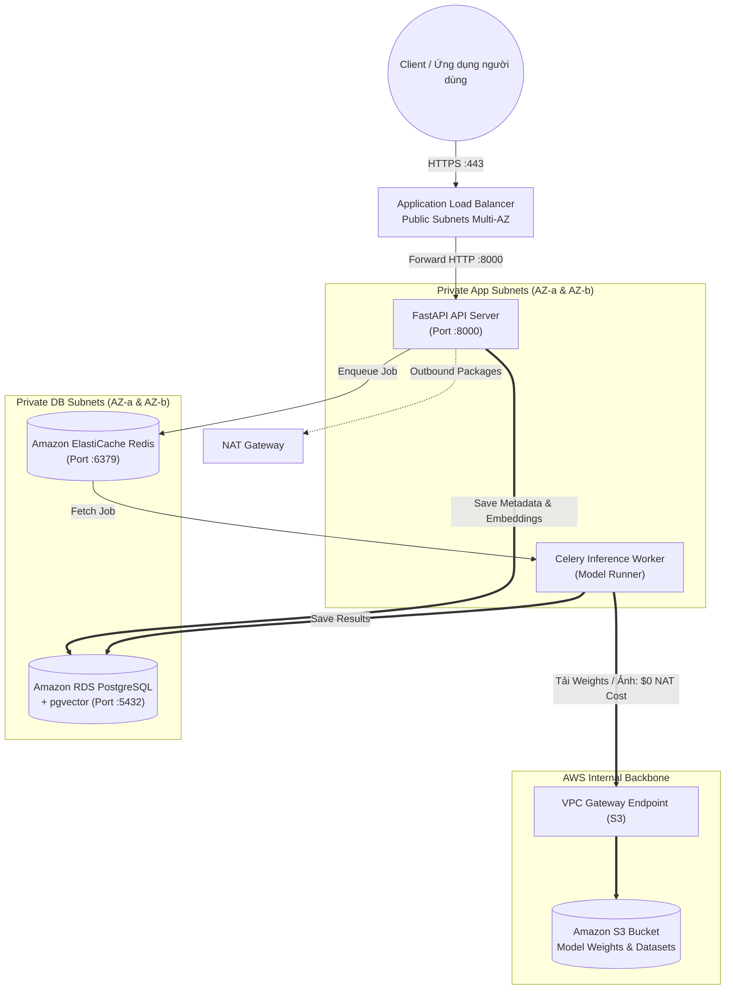

# 🚀 ĐĂNG KÝ Ý TƯỞNG SẢN PHẨM (AWS 4-WEEK CHALLENGE)
> **Thư mục:** `week-01/idea.md`  
> **Người thực hiện:** [Điền tên của bạn]  
> **Định hướng dự án:** AI / Data Engineering - AI Model Inference API & Data Pipeline  

---

## 1. Tên Dự án & Mục tiêu Ứng dụng

* **Tên dự án:** **IntelliFlow - Nền tảng AI Model Inference API & Real-time Data Pipeline**
* **Mục tiêu ứng dụng:**
  * Xây dựng hệ thống API phục vụ suy luận mô hình AI (Inference) tốc độ cao (ví dụ: bóc tách văn bản OCR, nhận diện vật thể hoặc nhúng vector văn bản - Text Embeddings) kết hợp pipeline xử lý dữ liệu bất đồng bộ.
  * Hỗ trợ hai chế độ xử lý:
    1. **Real-time Inference API:** Trả về kết quả dự đoán với độ trễ thấp (< 200ms) cho các tác vụ suy luận nhẹ.
    2. **Batch / Asynchronous Pipeline:** Đưa các tệp dữ liệu lớn (ảnh/tài liệu nhiều trang) vào hàng đợi (Queue), xử lý ngầm qua các Worker và lưu kết quả vào kho dữ liệu.
  * Toàn bộ hệ thống được triển khai trên hạ tầng mạng **Multi-AZ VPC** thiết kế ở Tuần 1, đảm bảo tính an toàn dữ liệu, tự động phục hồi sự cố và tối ưu triệt để chi phí truyền tải qua S3.

---

## 2. Công nghệ Sử dụng (Tech Stack)

| Thành phần | Công nghệ / Framework | Vai trò trong hệ thống |
| :--- | :--- | :--- |
| **Ngôn ngữ lập trình** | Python 3.11 | Ngôn ngữ chuẩn cho AI/ML và xử lý dữ liệu |
| **API Framework** | **FastAPI** | Cung cấp RESTful API hiệu năng cao, hỗ trợ Async/Await, tự động sinh tài liệu OpenAPI |
| **AI / Machine Learning** | **ONNX Runtime / PyTorch** | Chạy mô hình suy luận được tối ưu hóa (Optimized Inference Engine) |
| **Xử lý bất đồng bộ** | **Celery** | Quản lý tác vụ ngầm (Background Worker) cho các job suy luận nặng |
| **Message Broker & Cache** | Redis trên **Amazon ElastiCache** | Hàng đợi tin nhắn cho Celery và bộ nhớ đệm kết quả suy luận (Inference Cache) |
| **Cơ sở dữ liệu chính** | PostgreSQL trên **Amazon RDS Multi-AZ** | Lưu trữ metadata người dùng, lịch sử truy vấn, tích hợp extension **`pgvector`** để tìm kiếm tương đồng vector |
| **Lưu trữ tệp & Trọng số** | **Amazon S3** | Lưu trữ Model Weights (`.onnx` / `.pt`), hình ảnh đầu vào và kết quả phân tích |
| **Cân bằng tải & Mạng** | **Application Load Balancer (ALB)**, **Amazon VPC** | Tiếp nhận lưu lượng HTTPS, phân tải sang các container/máy chủ backend |

---

## 3. Cách Ứng dụng Tương tác với Hạ tầng VPC (Tuần 1)

Kiến trúc ứng dụng IntelliFlow được ánh xạ trực tiếp và tương tác chặt chẽ với mô hình phân tầng mạng Multi-AZ trong `week-01/notes.md`:

### Chi tiết tương tác từng tầng mạng:
1. **Tầng Public (Public Subnets - AZ-a & AZ-b):**
   * **Application Load Balancer (ALB)** là cổng giao tiếp duy nhất tiếp xúc với Internet, tiếp nhận request qua cổng HTTPS 443, xác thực SSL/TLS và cân bằng tải tới các máy chủ FastAPI trong mạng nội bộ.
   * **NAT Gateway** (gắn Elastic IP tĩnh) đặt tại đây để hỗ trợ các máy chủ Private tải package/cập nhật OS từ bên ngoài khi cần thiết.

2. **Tầng Ứng dụng & Suy luận AI (Private App Subnets - AZ-a & AZ-b):**
   * Chứa cụm máy chủ **FastAPI** và các **AI Inference Worker (Celery)**.
   * **Bảo mật tuyệt đối:** Hoàn toàn không có Public IP. Security Group của FastAPI chỉ mở cổng 8000 cho **Security Group ID của ALB**.
   * **Tối ưu chi phí truyền tải AI với VPC Endpoint:** Các Worker suy luận thường xuyên phải tải mô hình nặng (vài trăm MB đến vài GB) và dữ liệu hình ảnh từ **Amazon S3**. Nhờ có **VPC Gateway Endpoint**, toàn bộ dữ liệu này được truyền tải trực tiếp qua mạng nội bộ AWS với chi phí **$0** (không bị tính phí $0.045/GB của NAT Gateway) và độ trễ cực thấp.

3. **Tầng Dữ liệu & Hàng đợi (Private Database Subnets - AZ-a & AZ-b):**
   * Chứa cụm cơ sở dữ liệu **Amazon RDS PostgreSQL (Multi-AZ)** và cụm **Amazon ElastiCache Redis**.
   * **Cách ly hoàn toàn:** Không có đường định tuyến ra ngoài Internet (`0.0.0.0/0`).
   * Security Group của RDS chỉ chấp nhận kết nối trên cổng 5432 từ Security Group của FastAPI/Worker. Tương tự, Redis chỉ mở cổng 6379 cho các thành phần nội bộ trong Private App Subnet.

---

## 4. Kế hoạch Triển khai Thực tế cho Tuần 2
* **Đóng gói ứng dụng:** Viết `Dockerfile` và `docker-compose.yml` cho FastAPI API, Celery Worker và mô hình ONNX.
* **Tự động hóa hạ tầng (IaC):** Viết script (Terraform / CloudFormation / Bash AWS CLI) để triển khai hạ tầng VPC và khởi chạy máy chủ EC2/ECS kết nối cùng RDS trong mạng VPC đã thiết kế.
* **Kiểm thử hiệu năng (Benchmarking):** Đo lường độ trễ suy luận và kiểm tra khả năng chịu lỗi (Failover) khi ngắt kết nối một AZ.
