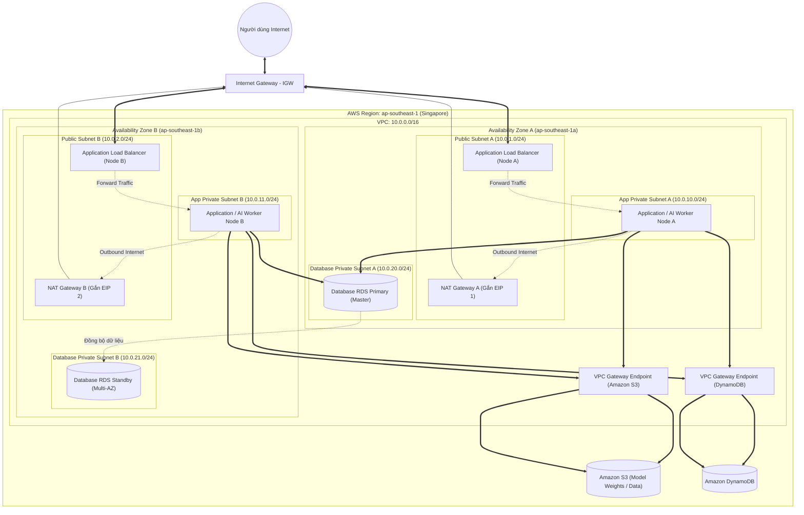

# 📘 BÀI THỰC HÀNH TUẦN 1: THIẾT KẾ HẠ TẦNG VPC & BẢO MẬT MẠNG (AWS 4-WEEK CHALLENGE)
> **Họ và tên học viên:** [Điền tên của bạn]  
> **Repository:** `ws-4week-challenge`  
> **Chủ đề tuần 1:** Network Isolation, VPC Multi-AZ Architecture & Defense-in-Depth Security  

---

## 1. Sơ đồ Kiến trúc Mạng Chuẩn (Multi-AZ VPC Architecture)

### 1.1. Sơ đồ trực quan (Mermaid Diagram)
Kiến trúc dưới đây được thiết kế theo tiêu chuẩn Well-Architected Framework của AWS, triển khai tối thiểu trên **2 Availability Zones (AZ-a & AZ-b)** nhằm đảm bảo tính sẵn sàng cao (**High Availability - HA**), khả năng chịu lỗi (**Fault Tolerance**) và tối ưu chi phí thông qua **VPC Endpoints**:



---

### 1.2. Bảng Quy hoạch Dải IP (Subnetting & CIDR Allocation)

* **Dải mạng VPC gốc:** `10.0.0.0/16` (Tổng cộng $65,536$ địa chỉ IP).
* Mỗi Subnet `/24` có $256$ IP, trong đó AWS dành riêng **5 IP** cho mục đích quản trị mạng nội bộ $\rightarrow$ Còn lại **251 IP khả dụng** cho tài nguyên.

| Tên Subnet | Availability Zone | CIDR Block | Loại Subnet | Chức năng & Tài nguyên chứa |
| :--- | :--- | :--- | :--- | :--- |
| `public-subnet-1a` | `ap-southeast-1a` | `10.0.1.0/24` | **Public** | ALB Node A, NAT Gateway A |
| `public-subnet-1b` | `ap-southeast-1b` | `10.0.2.0/24` | **Public** | ALB Node B, NAT Gateway B |
| `private-app-subnet-1a` | `ap-southeast-1a` | `10.0.10.0/24`| **Private** | Application / AI Inference Worker Node A |
| `private-app-subnet-1b` | `ap-southeast-1b` | `10.0.11.0/24`| **Private** | Application / AI Inference Worker Node B |
| `private-db-subnet-1a` | `ap-southeast-1a` | `10.0.20.0/24`| **Private** | RDS Database Primary (Ghi/Đọc) |
| `private-db-subnet-1b` | `ap-southeast-1b` | `10.0.21.0/24`| **Private** | RDS Database Standby (Dự phòng đồng bộ) |

---

### 1.3. Cấu hình Bảng Điều tuyến (Route Tables)

1. **Public Route Table (Gắn với các Public Subnets):**
   * `10.0.0.0/16` $\rightarrow$ `local` (Giao tiếp nội bộ giữa các Subnet trong VPC).
   * `0.0.0.0/0` $\rightarrow$ `igw-xxxx` (Đi ra và đón traffic từ Internet qua Internet Gateway).

2. **Private Route Table AZ-A (Gắn với App Subnet 1A):**
   * `10.0.0.0/16` $\rightarrow$ `local`.
   * `pl-xxxx (AWS S3 Prefix List)` $\rightarrow$ `vpce-xxxx-s3` (Lưu lượng S3 chạy trực tiếp qua VPC Endpoint).
   * `pl-yyyy (AWS DynamoDB Prefix List)` $\rightarrow$ `vpce-yyyy-ddb` (Lưu lượng DynamoDB chạy trực tiếp qua VPC Endpoint).
   * `0.0.0.0/0` $\rightarrow$ `nat-xxxx-a` (Gửi traffic ra ngoài Internet thông qua NAT Gateway tại AZ-A).

3. **Private Route Table AZ-B (Gắn với App Subnet 1B):**
   * `10.0.0.0/16` $\rightarrow$ `local`.
   * `pl-xxxx (AWS S3 Prefix List)` $\rightarrow$ `vpce-xxxx-s3`.
   * `pl-yyyy (AWS DynamoDB Prefix List)` $\rightarrow$ `vpce-yyyy-ddb`.
   * `0.0.0.0/0` $\rightarrow$ `nat-xxxx-b` (Gửi traffic ra ngoài Internet thông qua NAT Gateway tại AZ-B).

4. **Database Route Table (Hoàn toàn cô lập - Isolated):**
   * `10.0.0.0/16` $\rightarrow$ `local`.
   * **Không có route `0.0.0.0/0`**: Database không thể truy cập Internet và Internet tuyệt đối không thể chạm tới Database.

---

## 2. Giải thích Nguyên lý Cô lập Mạng (Network Isolation)

### 2.1. Tại sao Database hoặc Application Server bắt buộc phải đặt trong Private Subnet?

1. **Triệt tiêu hoàn toàn bề mặt tấn công từ Internet (Zero Internet Exposure):**
   * Tài nguyên trong Private Subnet **không được cấp Public IPv4**. Đồng thời, Route Table không trỏ tới Internet Gateway (IGW).
   * Do đó, hacker từ Internet không thể quét dải cổng (Port Scanning), dò quét lỗ hổng dịch vụ (Vulnerability probing), hay phát động tấn công Brute-force mật khẩu (SSH/RDP/MySQL/PostgreSQL) vào các máy chủ này.

2. **Mô hình Phòng thủ Đa tầng (Defense-in-Depth):**
   * Lớp ngoài cùng (Public Subnet) chỉ đặt Application Load Balancer (ALB). Mọi truy cập của người dùng bắt buộc phải đi qua ALB, nơi có thể tích hợp **AWS WAF** (Web Application Firewall) để chống SQL Injection, XSS, DDoS,...
   * Application Server chỉ nhận traffic đã qua kiểm duyệt được ALB chuyển tiếp vào thông qua dải IP Private nội bộ.
   * Database chỉ nhận kết nối duy nhất từ Security Group của Application Server. Kể cả khi hacker chiếm được quyền kiểm soát một thành phần mạng bên ngoài, họ vẫn bị chặn lại bởi các lớp rào chắn nội bộ.

3. **Bảo vệ tài sản dữ liệu cốt lõi & Tuân thủ tiêu chuẩn an toàn (Compliance):**
   * Dữ liệu trong Database là tài sản quý giá nhất của doanh nghiệp (thông tin người dùng, mật khẩu đã hash, giao dịch tài chính). Đặt Database ở Public Subnet là vi phạm nghiêm trọng các chuẩn bảo mật quốc tế như **PCI-DSS, ISO 27001, SOC 2, HIPAA**.

---

### 2.2. So sánh Chuyên sâu: Security Group (Stateful) vs NACL (Stateless)

| Tiêu chí so sánh | Security Group (SG) | Network ACL (NACL) |
| :--- | :--- | :--- |
| **Cấp độ hoạt động** | **Cấp độ Card mạng ảo (ENI / Instance Level)** | **Cấp độ Biên giới Subnet (Subnet Level)** |
| **Quy tắc cho phép/chặn** | **Allow-only** (Chỉ cho phép, không thể tạo rule chặn đích danh IP) | Hỗ trợ cả **ALLOW** và **DENY** (Chặn đích danh IP xấu) |
| **Thứ tự thực thi rule** | Đánh giá toàn bộ các rule trước khi quyết định | Đánh số thứ tự (Rule Number 100, 200,...). Rule nhỏ hơn được ưu tiên thực thi trước |
| **Trạng thái kết nối** | **Stateful (Có lưu giữ trạng thái)** | **Stateless (Không lưu trạng thái)** |
| **Mặc định khi tạo mới** | Chặn tất cả Inbound, mở tất cả Outbound | Mặc định Custom NACL: Chặn tất cả (Inbound & Outbound) |

---

### 2.3. Ví dụ Thực tế: Phân tích Cơ chế Stateful vs Stateless và Bẫy Cổng Tạm thời (Ephemeral Ports)

#### Kịch bản:
Một Web/API Server lắng nghe trên **Port 80 (HTTP)** hoặc **Port 443 (HTTPS)**. Một người dùng tại nhà mở trình duyệt truy cập vào server.

#### A. Đối với Security Group (Stateful):
* **Cấu hình:** Bạn chỉ cần thêm rule **Inbound: Allow Port 80 từ `0.0.0.0/0`**.
* **Cơ chế hoạt động:** 
  1. Gói tin SYN của client đi vào port 80 của EC2.
  2. Security Group nhận diện đây là một phiên kết nối hợp lệ và **tự động lưu vào bảng trạng thái (Connection Tracking Table)**.
  3. Khi Server xử lý xong và gửi gói tin phản hồi (Response) trở lại cho trình duyệt của client, Security Group tự động cho phép gói tin này đi ra ngoài mà **bạn không cần phải mở bất kỳ cổng Outbound nào**.

#### B. Đối với Network ACL (Stateless):
* **Cơ chế hoạt động:** NACL kiểm tra độc lập từng gói tin đi qua biên giới Subnet ở cả 2 chiều vào (Inbound) và ra (Outbound). Nó hoàn toàn không nhớ gói tin này thuộc phiên kết nối nào.
* **Bẫy cổng tạm thời (Ephemeral Port Trap):**
  * Khi trình duyệt máy khách (Client) gửi request tới Web Server, nó gửi từ một cổng tạm thời ngẫu nhiên do hệ điều hành cấp phát (thường nằm trong dải **`1024 - 65535`**).
  * Chiều vào (Inbound Subnet): Gói tin đi tới cổng 80 của Server $\rightarrow$ NACL Inbound cần có: `Rule 100: ALLOW TCP Port 80`.
  * Chiều ra (Outbound Subnet): Khi Server gửi gói tin trả lời về Client, đích đến của gói tin **không phải là port 80** mà là **cổng Ephemeral của Client (ví dụ: port 52341)**!
  * 👉 **Nếu bạn cấu hình sai**: Nếu Outbound NACL bạn chỉ cấu hình `ALLOW Port 80`, gói tin phản hồi sẽ bị NACL chặn đứng ngay lập tức tại biên giới Subnet $\rightarrow$ Kết nối của người dùng bị **Request Timeout** dù server đã xử lý thành công!
  * 👉 **Cấu hình chính xác bắt buộc của NACL**:
    * **Inbound Rule 100:** `ALLOW TCP Port 80` từ `0.0.0.0/0`.
    * **Outbound Rule 100:** `ALLOW TCP Port 1024-65535` đến `0.0.0.0/0`.

---

## 3. Tối ưu Chi phí & Bảo mật Thực chiến: VPC Gateway Endpoints (S3 & DynamoDB)

### 3.1. Bài toán Thực tế: "Cơn ác mộng chi phí NAT Gateway"
* **Bối cảnh:** Trong các ứng dụng hiện đại (đặc biệt là AI Inference, Data Pipeline hoặc xử lý ảnh/video), các server trong Private Subnet liên tục:
  1. Đọc model weights, hình ảnh, file dữ liệu từ **Amazon S3** (hàng chục GB đến hàng TB mỗi ngày).
  2. Đọc ghi hàng triệu lượt truy vấn trạng thái/session từ **Amazon DynamoDB**.
* **Vấn đề chi phí:** 
  * Mặc định, S3 và DynamoDB có địa chỉ IP Public. Máy chủ trong Private Subnet muốn giao tiếp với chúng phải đi qua **NAT Gateway**.
  * AWS tính phí xử lý dữ liệu qua NAT Gateway là **$0.045 / GB**.
  * Nếu một hệ thống AI xử lý 10 TB dữ liệu/tháng qua S3:
    $$\text{Chi phí NAT phát sinh} = 10{,}000 \text{ GB} \times \$0.045 = \mathbf{\$450 / \text{tháng}} \quad (\text{chưa tính phí duy trì giờ NAT Gateway!})$$

### 3.2. Giải pháp Kiến trúc: Cấu hình VPC Gateway Endpoints
* **Cách thức hoạt động:** Tạo **VPC Gateway Endpoint** cho Amazon S3 và Amazon DynamoDB gắn vào Route Table của Private Subnet.
* **Cơ chế định tuyến tự động:** AWS sẽ tự động thêm một Route đặc biệt vào Route Table của Private Subnet:
  ```text
  Destination: pl-63a5400a (com.amazonaws.ap-southeast-1.s3 - Prefix List) 
  Target: vpce-0a1b2c3d4e5f6g7h8 (S3 Gateway Endpoint ID)
  ```
* **Lợi ích vượt trội:**
  1. **Tiết kiệm 100% chi phí truyền tải:** VPC Gateway Endpoints cho S3 và DynamoDB là **hoàn toàn MIỄN PHÍ** ($0/giờ và $0/GB xử lý).
  2. **Hiệu năng & Băng thông vượt trội:** Lưu lượng truyền tải chạy trực tiếp qua mạng cáp quang nội bộ tốc độ cao của AWS Data Center, giảm thiểu độ trễ (latency) tối đa.
  3. **Bảo mật tuyệt đối:** Dữ liệu nội bộ không bao giờ đi qua Internet hay NAT Gateway. Có thể áp dụng **Endpoint Policy** để chỉ cho phép các worker trong VPC truy cập vào đúng các S3 Bucket cụ thể của dự án.
